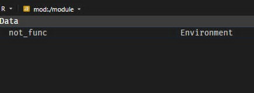

# Structuring and constructing modules part 1: Initialization

Let's start on how to construct a module preliminarily. To demonstrate how to write modules, let’s work with an example folder named `./module/`. Each script or subfolder within this directory will serve as a separate module (or even a submodule). In this guide, the files under `./module` are expected to be *empty*, or visit [./module](https://github.com/joshuamarie/modules-in-r/module) that contains the source code to view the pre-written code.

------------------------------------------------------------------------

## The structure

`{box}` modules, just like any modules from other programming languages, can go deeper. This is totally different from R where all the source R codes are placed under a flat `R/` structure. Here's the structure of the `./module` folder to be initialize:

``` bash
module/
├── __init__.r
├── convert.r
├── hello_world.r
├── matrix_ops.r              
├── not_func.r
├── tables.r                  
└── statistics/
    ├── __init__.r
    ├── cor.r
    ├── corrr.r
    ├── time_series.r
    └── models/               
        ├── __init__.r
        ├── linear.r
        ├── logistic.r
        └── baseline_logit.r
```

Observe that it has 2 levels deep nested modules, and it still can have multiple subdirectories inside `module/`. Once again, it can go deeper than 2 levels for each subdirectory. This is how module system should look like.

### Initialization

The `__init__.r` file is a special file, acts as the initialization file which marks `./module` folder as a *"package"*, in which will be executed once you import `./module` as a *module*. Once you have it, it is really beneficial because once you declare exports under `__init__.r`, that folder now acts like a module itself and you don't need to explicitly load the script as modules, repetitively. This `__init__.r` file feels too familiar to you when you came from Python.

Since you have `__init__.r` as an entry point, you load or expose specific functions or objects out from the submodules within this folder. You'll be always using this special file to treat folders as modules, equivalent to what made Python modules.

::: callout-important
*Every folder at every level* that you want to treat as a module must contain an `__init__.r` file. This applies to the (1) root module folder (`module/`), (2) any subfolders (`statistics/`), or even any nested subfolders (`statistics/models/`). Without `__init__.r`, `{box}` won't recognize the folder as a module.
:::

### Scripts from root folder

The root `module/` folder contains few (if not several) scripts that can be directly imported:

1.  `hello_world.r`: A simple demonstration script using examples from the official `{box}` documentation. This showcases basic module functionality and serves as a "Hello World" introduction to module creation.

2.  `convert.r`: Contains utility functions for temperature conversion:

    -   `celsius_to_fahrenheit()`: Converts Celsius to Fahrenheit
    -   `fahrenheit_to_celsius()`: Converts Fahrenheit to Celsius

    These functions demonstrate how standalone utility functions can be organized in modules.

3.  `matrix_ops.r`: Comprises with overloaded matrix operation functions and operators:

    -   Custom matrix multiplication operators
    -   Matrix transformation utilities

    This script demonstrates how to export functions with special characters (operators like `*` or `^`).

4.   `tables.r`: Contains table formatting and display functions:

    -   `draw_table()`: Displays data frames as table in terminal.

5.  `not_func.r`: Contains the exports that are not functions. This simply demonstrates that modules aren't limited to functions. This script contains various data structures that can be exported:

    -   Atomic vectors
    -   Lists
    -   Matrices
    -   Data frames
    -   N-dimensional arrays
    -   Constants or configuration values

    This shows that *any R object* can be part of a module's namespace, not just functions.

#### Subfolders (Submodules)

The module structure includes organized subfolders that group related functionality:

##### Statistical Analysis Submodule **`statistics/`**

A subfolder dedicated to contain statistical functions. When imported, this becomes the `{statistics}` submodule. Subfolders like this help categorically group related functionalities within a larger module structure.

1.  `__init__.r`: Always the **required initialization file**, if you want to mark `statistics/` as a submodule and controls which functions or scripts are exposed when someone imports the statistics module. Without this file, the folder cannot function as a module.

2.  `cor.r`: Contains basic correlation functions:

    -   Simple correlation coefficient calculations
    -   Demonstrates fundamental statistical operations

3.  `corrr.r`: An extended correlation module that builds on `cor.r`:

    -   Depends on `stats::cor()` for computation
    -   Uses `{tidyverse}` APIs for data manipulation
    -   Includes nonparametric correlation methods (Spearman, Kendall)
    -   Shows how modules can have dependencies on other modules and packages

4.  `time_series.r`: Contains time series analysis functions:

    -   Moving averages
    -   Trend analysis
    -   Seasonal decomposition
    -   Other time series utilities

    Groups all time series functionality under one module for easy access.

##### Statistical modelling nested submodule **statistics/models/**

A nested subfolder (two levels deep) for organizing machine learning and statistical modeling functions. This demonstrates **{box}**'s support for hierarchical module organization.

1.  `__init__.r`: Even though this folder is nested inside another module, it still needs its own `__init__.r` to be recognized as a submodule.

2.  `linear.r`: Linear regression functions.

3.  `logistic.r`: Logistic regression functions

::: {.callout-note title="Module Hierarchy"}
Notice how `models/` is nested inside `statistics/`, creating a hierarchy:

-   `module/` (root)

    -   `statistics/` (submodule)

        -   `models/` (nested submodule)

Each level requires its own `__init__.r` file. This organization allows you to access functions like:

-   `module$statistics$models$linear$fit_regression()`

-   Or with aliases: `lm_models$fit_regression()`
:::

## Importing **{./module}**

Now that you’ve seen the structure of the `./module` folder, you may want to reuse the codes under `./module`, by forking [./module](https://github.com/joshuamarie/modules-in-r/module), found at the source code of this book, into any specified directory. Let's recall what is on about throughout [Chapter 2: Fundamentals of import system in **{box}** package](2-imports.qmd). In this example, we are importing scripts / folders from `./module` folder, as modules instead.

### Valid imports

Here are the valid imports:

1.  With alias

    ``` r
    box::use(
        md = ./module
    )
    ```

    *Note: It's up to you if you want another name, besides `md`.*

2.  Without alias

    ``` r
    box::use(
        ./module
    )
    ```

3.  Load specific subfolder as a module

    ``` r
    box::use(
        md_stats = ./module[statistics]
    )
    ```

    This is equivalent to:

    ``` r
    box::use(
        md_stats = ./module/statistics
    )
    ```

    As long as the `statistics/` subfolder is publicly exported under the initialization `__init__.r` file.

4.  Load specific script as a module

    ``` r
    box::use(
        md_dt = ./module[not_func]
    )
    ```

    Note: This is not entirely equivalent to:

    ``` r
    box::use(
        md_dt = ./module/not_func
    )
    ```

    Here, `md_dt` is loaded as a module that carries the whole `./module` folder, not the `not_func` script. On the other hand, the second code will load `not_func` script as a module under `md_dt` name.

    

::: callout-note
Do not forget to put `./` prefix to load specific local modules in your own workspace. The lack of `./` prefix is only valid for R packages. For the deep nested modules, this will be deeply tackled in [Chapter 3.4: Accessing modules in any depths](./5-nested-modules.qmd).
:::

## Reloading modules

As discussed on Chapter 2, there are times you need to reload the module, only during the development and in an interactive session, most particularly when you import a particular module then you modify its source code. However, `{box}` modules are cached after their first import. This means that changes you make to your module’s code won’t automatically take effect until you explicitly reload it.

### Basic Reloading

To reload a module, `{box}` provides the function `box::reload()`. This clears the cached version and re-imports the module, ensuring that the latest code changes are applied.

If you’ve imported the module, such as:

``` r         
box::use(
    md = ./module
)
```

and you made some changes within its source code, you can reload it simply by:

``` r
box::reload(md)
```

And note: Reloading *submodules* under `md` module is not valid, even though `statistics` here is a module.

``` r
# Bad
box::reload(md$statistics)

# Good
box::reload(md)
```
