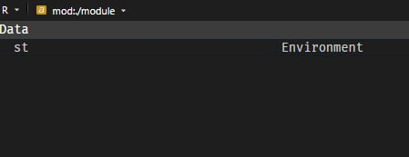

# Structuring and constructing modules part 2: Package-like Modules

The previous parts teach you on how to import a module (whether that module is a package or a local scripts/folders) and declare exports from a module. In this section, you'll learn on how to write a module that emulates the modular programming paradigm in other languages such as Python. One of the strengths of `{box}` is that, unlike R packages, it requires less boilerplate to write a module just to make R codes reusable and make it accessible to other end-users. By composing a module, this feels like you are writing a package without requiring another boilerplates. It's modular, maintainable, and accessible.

---

## Get started: modules from the root folder 

Recall the `not_func.r` script on the previous part of Chapter 3. Keep it and this time, create another scripts named `convert.r` and `hello_world.r`. 

::: {.callout-tip title="Did you know? "}

Also recall that `#' @export` is a borrowed syntax from Roxygen2 and is used if necessary when you declare exports of the module on specific part of the assigned R code into the namespace. There's `box::export()` but the `#' @export` tag is more preferred than it. When `#' @export` is placed, it triggers the Roxygen2 functionality, where it keeps the public namespace from the private namespace. 

:::

::: panel-tabset

### `convert.r` 

Here are the codes containing functions for converting temperatures. Copy this code:

``` r
celsius_to_fahrenheit = function (celsius) {
    fahrenheit = (celsius * 9/5) + 32
    fahrenheit
}

fahrenheit_to_celsius = function (fahrenheit) {
    celsius = (fahrenheit - 32) * 5/9
    celsius
}
```

### `hello_world.r` Simple greetings

These examples are "simple greetings" function, and they are example codes from the official documentation of `{box}` package. 

``` r
#' @export
hello = function (name) {
    message('Hello, ', name, '!')
}

#' @export
bye = function (name) {
    message('Goodbye ', name, '!')
}
```

:::

As you can see, the composability is that simple. To declare the exports, choose either `#' @export` tag or through `box::export()`, e.g. `box::export(celsius_to_fahrenheit, fahrenheit_to_celsius)`, `box::export(hello, bye)`. To reuse them, simply refer their relative paths in valid bare names, not on quotes, under `box::use()` call. 

```{r}
box::use(
    ./module/convert, 
    greet = ./module/hello_world
)

temperature = 212

glue::glue(
    "{temperature} degrees Fahrenheit is equivalent to {convert$fahrenheit_to_celsius(temperature)} degrees Celsius"
)

greet$hello("Amy")
```

Assuming you have `__init__.r` initialization file already but still empty. If empty and when `./module` is imported on `box::use()`, you'll get nothing. `__init__.r` must contain some exports to mark `./module` as a package. Here's an example `__init__.r`:

``` r
#' @export
box::use(
    ./hello_world,
    ./not_func,
    ./convert, 
)

# box::export(hello_world, not_func) # only when `#' @export` tag is not used
```

Then try the following:

```{r}
box::use(
    md = ./module
)

temperature = 212

glue::glue(
    "{temperature} degrees Fahrenheit is equivalent to {md$convert$fahrenheit_to_celsius(temperature)} degrees Celsius"
)

md$hello_world$hello("Amy")
```

If you want functions from `hello_world.r` to be directly accessible, i.e. no deep `$` extract, just from `module` itself, but `hello_world` is not a module under `./module` anymore, then do the following: 

``` r
#' @export
box::use(
    ./hello_world[...],
    ./not_func,
    ./convert, 
)
# box::export(hello, bye, not_func, convert)
```

And by the way, when you are on interactive session (say, on your R console), you can apply aliases for the script accessed as a module, not limited to functions and any objects:

``` r
box::use(
    ./module[hw = hello_world],
    ./module[cv = convert], 
    ./module[nf = not_func]
)
```

## Subfolders as modules

Under `./module`, let's create a subfolder named `statistics/`, where the small set of statistical functions are contained in separate scripts. Don't forget the `__init__.r` initialization file to mark whole `statistics/` as a module. 

Here is the structure:

``` bash
statistics/
├── __init__.r
├── cor.r
├── corrr.r
└── time_series.r
```

*Get the source code of each script [here](https://github.com/joshuamarie/modules-in-r/tree/main/module/statistics)*

Access all of the modules within `statistics/` by:

```{r}
box::use(
    tsm = ./module/statistics/time_series, 
    md_sts = ./module/statistics,
    ./module/statistics/corrr[cor_pipe],
)
```

Example:

```{r}
with(cars, md_sts$cor$custom_cor(speed, dist))

mtcars |> 
    cor_pipe(mpg, hp, disp, qsec)

mas = tsm$moving_average(AirPassengers, win = 3)

plot(
    seq_along(AirPassengers),
    AirPassengers, 
    type = "l",
    col = "blue", 
    lwd = 2, 
    xlab = "Time Index", 
    ylab = "Passengers", 
    main = "AirPassengers with Moving Averages"
)

lines(mas, col = "red")
```

If you want everything under `statistics/` subfolder as a module, here's what `__init__.r` file should looks like:

``` r
#' @export
box::use(
    ./cor_nse,
    ./cor,
    ./moving_average
)
```

And when you try want the every function directly accessible when `statistics/` subfolder is directly imported, this is what `__init__.r` should looks like:

``` r
#' @export
box::use(
    ./cor_nse[...],
    ./cor[...],
    ./moving_average[...]
)
```

::: {.callout-tip title="Recall Chapter 3.1.2"}

Assuming you also declare `statistics/` subfolder as an export from the `./module`, you can also do the following: 

```{r}
box::use(
    ./module[st = statistics]
)
```

Although this doesn't differ from the following:

``` r
box::use(
    st = ./module/statistics
)
```

This is still good to know. 



:::
